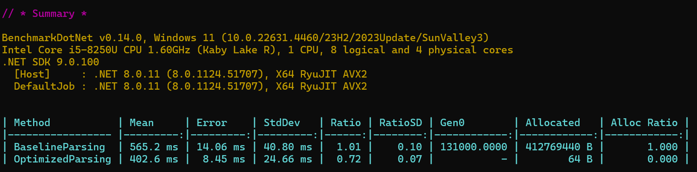

### Scenario:
We're working with a computational geometry application where millions of 3D points need to be parsed from a file containing strings in the format: "(x, y, z)".
The parsing process must be highly efficient to avoid unnecessary heap allocations and reduce garbage collection pressure.

### Baseline implementation analysis
The baseline approach uses ``Split`` and ``Substring`` string methods, which are less efficient as they create new strings each time their called.
Strings are heap allocated thus this approach places more strain on the GC also increasing execution time.

### Optimized implementation analysis
Using ``Span<char>`` significantly reduces allocations, only using stack allocated pointers.

### Potential Pitfalls
Stack overflow: ``span.Slice()`` creates a new span on the stack each time it's executed.
So although we're transferring load from the heap to the stack we have to be careful and monitor that we
don't allocate too much memore on the stack causing stack overflow.